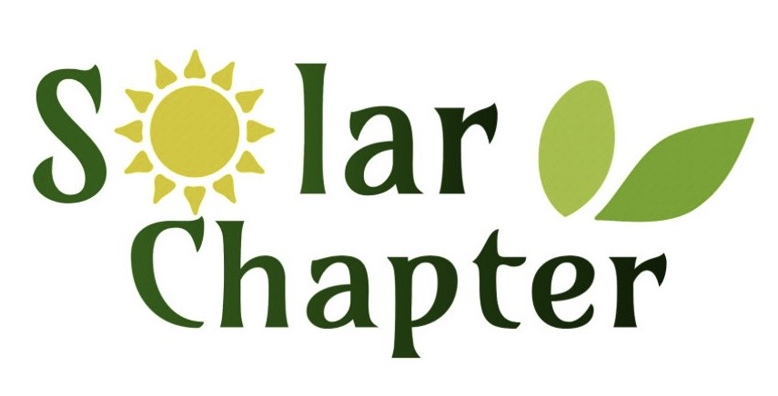

  

<h1 align="center">Kain Makna</h1>

  A meaningful kain collection by Solar Chapter Asia Pacific.

---

## About Kain Makna

Discover **Kain Makna**, an exclusive collection by **Solar Chapter Asia Pacific**, handcrafted with care by the incredible Mama artisans of **West Lakekun Village, East Nusa Tenggara (NTT)**. Each piece carries not just cultural heritage, but also a powerful story of resilience, craftsmanship, and community.

By supporting this collection, you are directly empowering these Mamas to sustain their livelihoods and support their families. Beyond that, every purchase contributes to our mission of bringing sustainable clean water access to underserved villages, turning fabric into lasting impact.

Now available for pre-order, each kain is made with meaning and purpose. Whether you are in Indonesia or overseas, your order is expected to arrive between late May and June.

**Be part of something bigger: wear the story, support the change.**

## Pre-Order Period

**May 9, 2026 – May 23, 2026**

## Order Now

Place your pre-order here: [https://scapac-makna.vercel.app/](https://scapac-makna.vercel.app/)

## Contact

For questions or order assistance, please contact: **solchap.makna@gmail.com**
